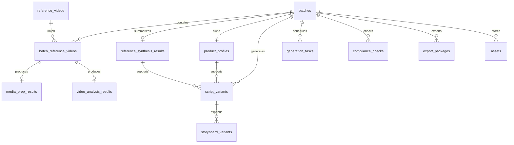

# 爆款视频分镜平台 V1 数据库表结构设计

## 1. 设计基线

- 数据库基线：`PostgreSQL 15+`
- 主键方案：统一使用 `UUID`
- 时间字段：统一使用 `timestamptz`
- 结构化模型输入/输出：优先使用 `jsonb`
- V1 目标：先支撑批量生产链路稳定跑通，再为 V2 多参考视频做兼容预留

## 2. 建模原则

- `Batch` 是业务主聚合，脚本、分镜、任务、导出都围绕批次展开
- `ReferenceVideo` 作为全局视频主数据，`BatchReferenceVideo` 负责批次内选择关系
- 模型原始输出尽量保留，不在 V1 过度拆表，避免损失提示词上下文和导出结构
- 九镜头编辑采用“双份 JSON”设计：保留系统默认版本，同时保存用户当前版本，便于恢复默认
- 任务系统采用统一任务表，脚本生成、分镜生成、分析、导出走同一套调度与重试机制
- 素材统一进入 `assets`，通过 `asset_role` 区分产品图、角色图、九宫格图、导出包等

## 3. 核心关系

## 4. 表清单

| 表名 | 作用 | 关键字段 |
| --- | --- | --- |
| `batches` | 批次主表 | `status`, `script_target_count`, `progress_percent`, `settings` |
| `reference_videos` | FastMoss/TikTok 视频主数据 | `platform`, `external_video_id`, `author_name`, `play_count`, `engagement_rate`, `raw_payload` |
| `batch_reference_videos` | 批次与参考视频关系表 | `is_selected`, `selection_rank`, `query_snapshot` |
| `media_prep_results` | 视频下载与预处理结果 | `status`, `download_strategy`, `diagnostic_payload` |
| `video_analysis_results` | Gemini 视频分析结果 | `analysis_payload`, `summary_payload`, `confidence_score` |
| `reference_synthesis_results` | 多参考视频兼容汇总结果 | `source_video_count`, `synthesis_payload`, `traceability_payload` |
| `product_profiles` | 产品资料包 | `product_name`, `selling_points`, `allowed_claims`, `forbidden_claims` |
| `assets` | 统一文件资产表 | `asset_role`, `storage_key`, `external_url`, `meta` |
| `script_variants` | 批量生成脚本 | `sequence_no`, `style_base`, `script_text`, `script_payload`, `is_selected` |
| `storyboard_variants` | 九镜头 JSON 与九宫格版本 | `variant_no`, `system_payload`, `current_payload`, `is_user_edited` |
| `generation_tasks` | 通用异步任务表 | `task_type`, `status`, `retry_count`, `target_type`, `target_id` |
| `compliance_checks` | 合规检查结果 | `target_type`, `risk_level`, `issues`, `suggestion_summary` |
| `export_packages` | 导出包记录 | `status`, `export_scope`, `included_counts` |

## 5. 关键表设计说明

### 5.1 `batches`

作为业务入口表，建议直接保存批次级统计字段，避免列表页每次做高成本聚合。

建议字段：

- `name`：批次名称
- `status`：批次状态
- `reference_video_limit`：V1 固定为 `1`
- `script_target_count`：默认 `10`，最大 `50`
- `progress_percent`：批次进度
- `script_generated_count` / `storyboard_generated_count` / `failed_task_count`
- `settings`：批次级运行参数，例如并发上限、默认风格比例、导出偏好

### 5.2 `reference_videos` + `batch_reference_videos`

这两张表拆开是为了兼容 V2 多参考视频和视频主数据复用：

- `reference_videos` 保存平台视频基础信息和原始返回
- `batch_reference_videos` 保存某个批次里“用了哪些视频、是否被选中、筛选快照是什么”

V1 通过唯一索引保证“每个批次最多 1 条已选参考视频”。

### 5.3 `media_prep_results`

只保存“最终可用于分析的素材准备结果”，重试过程交给 `generation_tasks` 记录。

建议字段：

- `status`
- `download_strategy`：主链路、降级链路
- `prepared_spec`：输出规格，例如分辨率、时长、编码
- `diagnostic_payload`：失败信息、降级说明、第三方响应摘要

### 5.4 `video_analysis_results`

视频分析结果不建议在 V1 过度拆字段，原因是：

- 模型输出结构会持续迭代
- 后续提示词和分析模板会频繁变化
- 产品实际需要的是“可回放、可导出、可复用”的完整分析对象

因此建议：

- `analysis_payload` 保存结构化完整 JSON
- `summary_payload` 保存页面摘要和标签化结果
- `normalized_tags` 用于列表筛选

### 5.5 `product_profiles`

V1 每个批次绑定 1 个产品资料包，因此 `batch_id` 直接做唯一约束。

建议把这些字段保留为结构化数组或 JSON：

- `selling_points`
- `allowed_claims`
- `forbidden_claims`
- `required_selling_points`
- `usage_scenarios`

这样后续更容易拼接提示词和做合规比对。

### 5.6 `assets`

统一素材表负责托管：

- 参考视频下载文件
- 产品白底图
- 真人参考图
- 宠物参考图
- 九宫格图片
- 导出压缩包

建议使用 `asset_role` 做业务分类，而不是拆成多张附件表。这样能减少重复字段，并统一接入对象存储。

### 5.7 `script_variants`

每条脚本是一个独立创意变体。

建议字段：

- `sequence_no`：批次内编号
- `style_base`：稳妥转化型 / 强钩子型 / 氛围种草型
- `script_text`：脚本正文
- `script_payload`：结构化脚本数据
- `generation_tags`：来源标签、风格标签、卖点标签
- `source_trace`：引用了哪个参考分析、用了哪些产品卖点
- `is_selected`：是否被用户选中进入分镜阶段

### 5.8 `storyboard_variants`

这里建议不要把九镜头在 V1 拆成 `9` 行子表，先用 JSONB 存整包：

- `system_payload`：系统默认版九镜头 JSON
- `current_payload`：当前可编辑版九镜头 JSON
- `source_script_snapshot`：生成时的脚本快照
- `variant_no`：同一脚本下第几版分镜，V1 最多 `3`

这样能同时满足：

- 页面直接按 JSON 编辑
- 一键恢复系统默认版本
- 原样导出 JSON
- 降低模型输出格式变更带来的迁移成本

如果后续要做镜头级检索、统计或镜头复用，再补 `storyboard_shots` 读模型表更合适。

### 5.9 `generation_tasks`

任务表是整套系统的执行中枢，建议统一覆盖：

- 视频同步
- 视频下载/预处理
- 视频分析
- 参考结果汇总
- 脚本生成
- 九镜头拆解
- 九宫格生成
- 合规检查
- 导出打包

关键字段建议：

- `task_type`
- `status`
- `target_type` + `target_id`
- `request_payload`
- `result_payload`
- `retry_count` / `max_retries`
- `priority`
- `queued_at` / `started_at` / `finished_at`

如果后续要做批量任务树，可以直接用 `parent_task_id`。

### 5.10 `compliance_checks`

V1 是风险提示，不阻断，所以建议按“快照结果”设计，而不是实时计算：

- `target_type`：脚本或分镜
- `target_id`
- `risk_level`
- `issues`：问题数组
- `suggestion_summary`

这样历史结果可追溯，也方便后续比较多次检查结果。

### 5.11 `export_packages`

导出建议独立成表，不直接把压缩包挂在批次上：

- 支持反复导出
- 支持不同导出范围
- 支持失败重试和历史追踪

## 6. 关键约束

### 6.1 可直接落库的约束

- 一个 `batch` 最多 1 条已选参考视频
- 一个 `batch` 仅 1 个 `product_profile`
- 一个脚本下 `storyboard_variant.variant_no` 唯一
- 一个批次内 `script_variants.sequence_no` 唯一
- `storyboard_variant.variant_no` 限制在 `1~3`
- `script_target_count` 限制在 `1~50`

### 6.2 更适合放在应用层的约束

- 单批次脚本总数最多 `50`
- 未上传真人/宠物参考图时给出一致性风险提示
- 默认先生成脚本，再允许生成九宫格
- 九宫格图片不得出现文字覆盖元素

这些规则更依赖业务流程，不建议全部用数据库约束硬编码。

## 7. 索引建议

- `reference_videos(platform, external_video_id)` 唯一索引
- `batch_reference_videos(batch_id, reference_video_id)` 唯一索引
- `batch_reference_videos(batch_id)` 条件唯一索引：`is_selected = true`
- `script_variants(batch_id, sequence_no)` 唯一索引
- `script_variants(batch_id, is_selected, created_at desc)` 普通索引
- `storyboard_variants(script_variant_id, variant_no)` 唯一索引
- `generation_tasks(status, task_type, priority, queued_at)` 队列索引
- `generation_tasks(target_type, target_id, created_at desc)` 回查索引
- `assets(batch_id, asset_role, created_at desc)` 素材索引
- `video_analysis_results` / `script_variants` / `storyboard_variants` 的 `jsonb` 字段按实际检索需求增补 `GIN` 索引

## 8. V2 兼容点

- `batch_reference_videos` 已支持一个批次挂多条参考视频
- `reference_synthesis_results` 已预留多视频融合结果
- `source_trace` / `traceability_payload` 已预留来源追踪
- `generation_tasks.parent_task_id` 已支持任务树
- `assets` 统一素材模型后，后续接入更多生成物类型不需要重构

## 9. 本次交付物

- 表结构说明文档：当前文件
- PostgreSQL DDL 草案：`schema.sql`

## 10. 建议的下一步

1. 先确认是否以 `PostgreSQL` 作为正式基线
2. 确认是否需要现在就引入 `users` / `organizations`
3. 确认脚本与分镜是否需要版本审计
4. 确认对象存储字段规范，例如 `bucket`、`key`、CDN URL
5. 评审通过后，把 `schema.sql` 接进迁移工具
